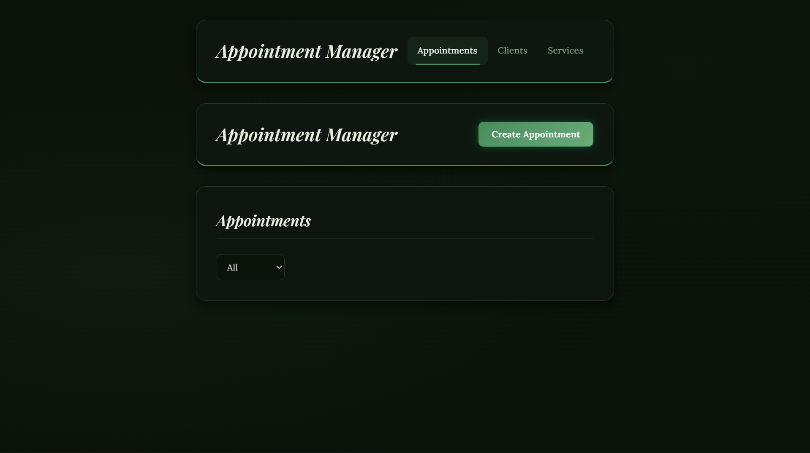
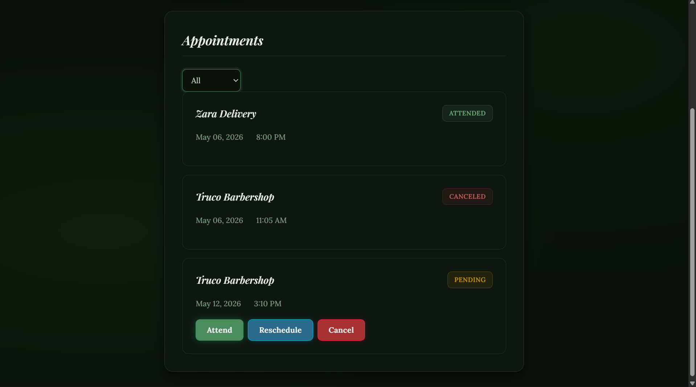
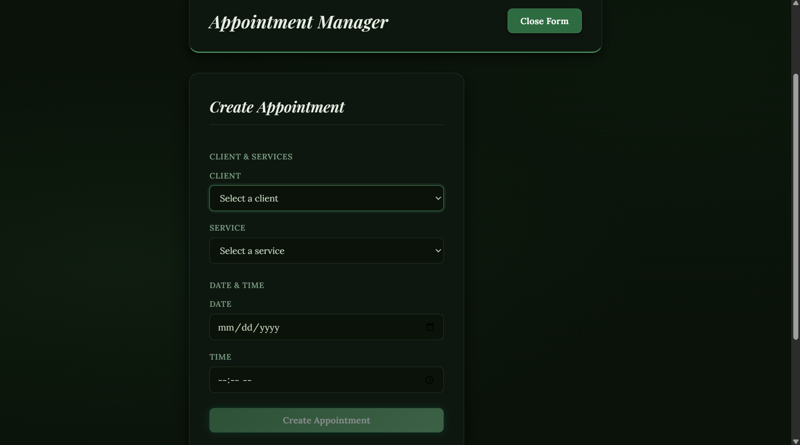
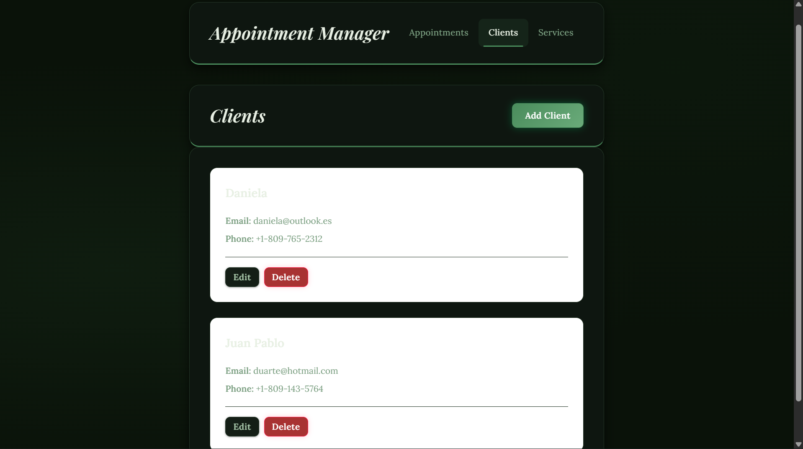
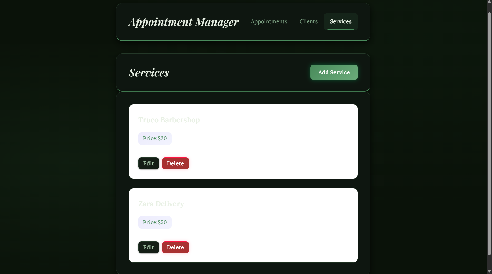

# Appointments Manager

Full-stack appointment management system built to manage clients, services and appointments.
Prevent scheduling conflicts and handle appointment lifecycle states.

This project was developed as a learning-focused, architecture-driven system, prioritizing separation of concerns, business rules validation and maintainability.

## Problem Statement

Managing appointments manually often leads to scheduling conflicts, duplicated bookings and poor visibility over appointment status.

This system allows a business (e.g. barbershop, clinic, service provider) to:

- Create appointments for clients and services
- Prevent double-booking conflicts
- Reschedule appointments safely
- Track appointment states (pending, attended, canceled)

## Architecture Overview

The project is divided into two independent layers:

- *Backend*: REST API responsible for business rules, validation and data persistence.

- *Frontend*: Single Page Application (SPA) responsible for user interaction and UI rendering.

All critical business logic (e.g. double-booking prevention) lives in the backend.
The frontend focuses on presentation, user experience and API consumption.

## Tech Stack

### Backend
- Node.js
- Express
- SQLite
- Layered architecture (routes / controllers / services / repositories)

### Frontend
- Vue 3
- Composition API
- Vue Router
- Fetch API
- Basic accessibility (a11y) practices

## Project Structure

```
appointment-manager/
├── appointments-manager-backend/
│   ├── src/
│   │   ├── app.js
│   │   ├── server.js
│   │   ├── constants/
│   │   │   └── appointmentStatus.js
│   │   ├── controllers/
│   │   │   ├── appointments.controller.js
│   │   │   ├── clients.controller.js
│   │   │   └── services.controller.js
│   │   ├── db/
│   │   │   ├── database.js
│   │   │   └── schema.js
│   │   ├── repositories/
│   │   │   ├── appointments.repository.js
│   │   │   ├── clients.repository.js
│   │   │   └── service.repository.js
│   │   ├── routes/
│   │   │   ├── appointments.routes.js
│   │   │   ├── clients.routes.js
│   │   │   └── services.routes.js
│   │   └── services/
│   │       ├── appointment.service.js
│   │       ├── client.service.js
│   │       └── service.service.js
│   ├── test/
│   │   ├── appointments.cancel.test.js
│   │   ├── appointments.double.test.js
│   │   ├── appointments.status.test.js
│   │   └── setup.js
│   ├── jest.config.js
│   ├── package.json
│   └── README.md
│
├── appointments-manager-frontend/
│   ├── src/
│   │   ├── App.vue
│   │   ├── main.js
│   │   ├── constants.js
│   │   ├── assets/
│   │   │   └── styles/
│   │   │       ├── appointments.css
│   │   │       ├── base.css
│   │   │       ├── buttons.css
│   │   │       ├── forms.css
│   │   │       ├── modals.css
│   │   │       └── navigation.css
│   │   ├── components/
│   │   │   ├── AppHeader.vue
│   │   │   └── appointments/
│   │   │       ├── AppointmentForm.vue
│   │   │       ├── AppointmentItem.vue
│   │   │       └── AppointmentList.vue
│   │   ├── composables/
│   │   │   ├── useAppointments.js
│   │   │   ├── useClients.js
│   │   │   ├── useFocusTrap.js
│   │   │   └── useServices.js
│   │   ├── router/
│   │   │   └── index.js
│   │   ├── services/
│   │   │   └── api.js
│   │   ├── utils/
│   │   │   └── formatters.js
│   │   └── views/
│   │       ├── AppointmentDetailView.vue
│   │       ├── AppointmentsView.vue
│   │       ├── ClientsView.vue
│   │       └── ServicesView.vue
│   ├── public/
│   ├── index.html
│   ├── jsconfig.json
│   ├── package.json
│   ├── vite.config.js
│   └── README.md
│
├── .gitignore
└── README.md
```

## Screenshots







## Running the Project

### Backend
```bash
cd appointments-manager-backend
npm install
npm start

http://localhost:3000
```

### Frontend
```bash
cd appointments-manager-frontend
npm install
npm run dev

http://localhost:5173
```

## Deployment

This project is ready to deploy with:

- Vercel for the frontend
- Render for the backend

### Backend on Render

The repository includes [render.yaml](./render.yaml) to create the backend service as a Render Blueprint.

Important production settings:

- `PORT`: provided automatically by Render
- `DB_PATH`: set to `./data/database.sqlite` for Render free tier
- `FRONTEND_ORIGIN`: set this to your Vercel frontend URL

In Render free tier, SQLite data is ephemeral and can be lost on restarts/redeploys.

If you later upgrade to a paid plan with persistent disk, use `DB_PATH=/var/data/database.sqlite` and mount a disk in `/var/data`.

Health check endpoint:

- `GET /health`

### Frontend on Vercel

The frontend now reads the API base URL from `VITE_API_URL`.

Set this environment variable in Vercel:

- `VITE_API_URL=https://your-render-backend.onrender.com`

The repository includes [appointments-manager-frontend/vercel.json](./appointments-manager-frontend/vercel.json) to support SPA routing with Vue Router.

### Recommended deploy order

1. Deploy the backend to Render.
2. Copy the Render public URL.
3. Deploy the frontend to Vercel with `VITE_API_URL` pointing to that backend URL.
4. Update `FRONTEND_ORIGIN` in Render with the final Vercel domain.

## Key Technical Decisions

- Appointment states are modeled as constants instead of booleans to support multiple final and transitional states.

- Double-booking validation is enforced in the backend to guarantee consistency regardless of frontend behavior.

- Services and clients use soft delete to preserve historical integrity.

- Frontend uses composables to centralize API logic and state handling.

## Project Status

Core backend functionality implemented  
Frontend appointment management UI  
Routing and navigation  
Basic accessibility for modals  

### Planned improvements:
- Appointment detail views
- Enhanced accessibility (focus trap improvements)
- UI polish and animations
